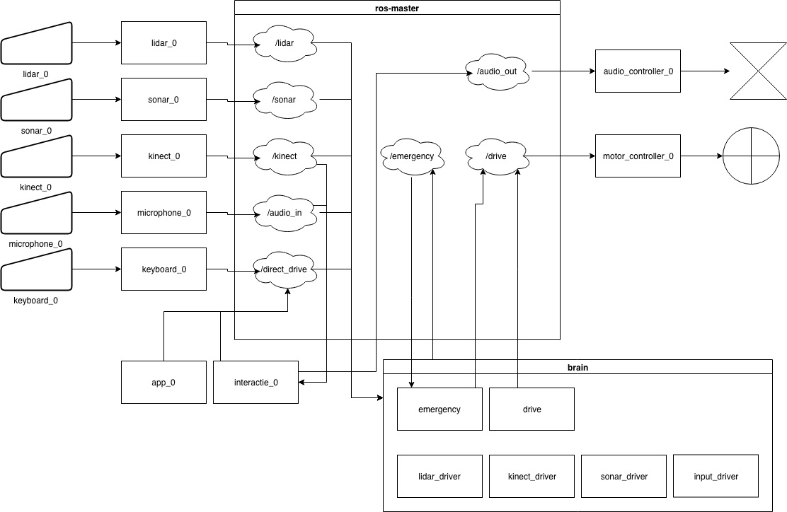

include::../Header.adoc[]

== Software Architecture

=== Standpoints

The software architecture needs to be compartmented for development purposes. To make sure the development does not compromise the system as a whole the following standpoints are defined to fortify the design.
 
* Each separate function gets a separate repository
* Each separate function has no dependency to another
* The GiT proces is applied for every repository
* Every function is running hardware independent
* Every function is running OS independent

=== Design

Embedding these standpoints into the Robotic Operating System (ROS) resulted in the following architecture design. 

=== ROS Master

A key feature of ROS is the topic communication. Separation of each function in the ROS master, which facilitates the topics, is a key component. Every function communicates according a topic and therefore ROS master functions as a servicebus for each current and future feature. 

[NOTE]
Designing this architecture and keeping it up to date can be done by importing/edditing the xml files in https://www.draw.io/. 
Draw.io is free of charge to use and requires no client. 