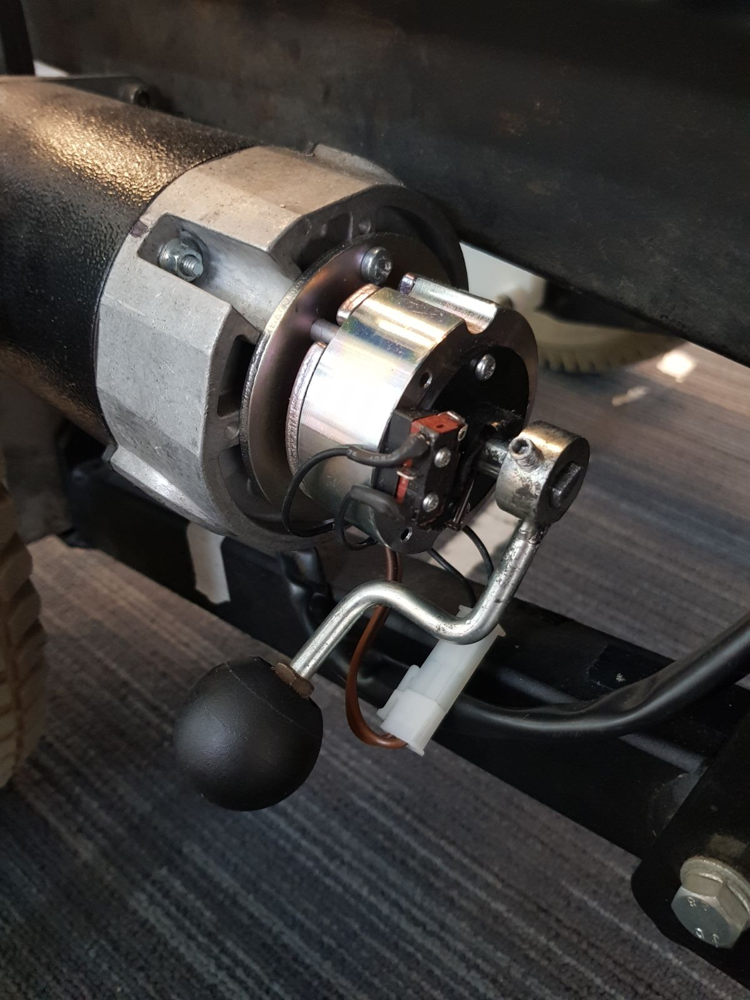
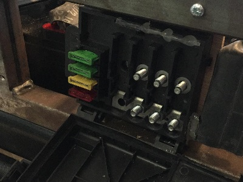
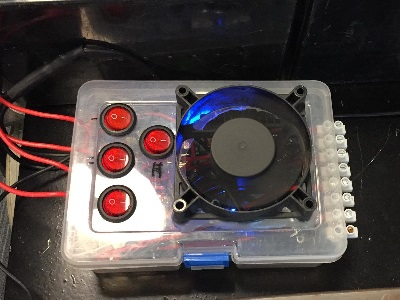

include::../Header.adoc[]

== Hardware

=== Overview
A simple overview of all the hardware in Willy is given in the
following scheme:

image:../media/Network_Drawing.PNG[image]

=== Components
This chapter contains all the components with explanation.

==== Laptop
This is the dedicated computer for running the ROS Server. All the heavy calculations, such as route-planning, will be done on this laptop. Therefore, we chose for a computer with proper
calculation power as well as enough RAM.

[cols=",",options="header",]
|===============================================
|Product |Fujitsu Lifebook E752
|CPU |Intel Core I5 3210M 2.5GHz dual-core
|Video Chip |Intel HD Graphics
|RAM |16 GB DDR3L Sodimm
|Harddisk |Western Digital Black 500GB 2,5" HDD
|Amount of USB Ports
a|
- 1x USB3.0
- 1x USB3.0 / eSATA
- 4x USB2.0
|Other Ports
a|
- 1x VGA
- 1x DisplayPort
- 1x 1GB/s Network Port
- 1x RS232
- 1x Microphone Jack
- 1x Headphone Jack
- 1x PCMCIA
- 1x SD Cardreader
|Wireless Connection options |WLAN chip
|===============================================

==== Raspberry Pi
Windesheim has provided us with spare Raspberry Pi's. In order to make the physical hardware modular and offload certain tasks from the laptop, we used four of these Raspberry Pi's. These are all installed by applying a specific OS image and the contents of the defined git repositories per Pi. Installation of each Raspberry Pi is described in the respective Git repository.

==== Motors and controller
Willy contains 2 motors from a second-hand mobility scooter. A previous
project group has chosen this option as documented in the ‘Ontwerp verslag’.
(Ontwerpverslag, 2016)

These motors need 24 volts and use a maximum of 20 amps. One of the previous project
groups created the motor controller to control the motors. This is
documented in the ‘Systeem dossier’ from a previous project group.
(Systeem Dossier, 2016)

image:../archive/2018S1/Research/media/current-status/image4.jpeg[image]

This motor controller is made by using an Arduino Mega and a custom
shield with additional custom hardware. The controller receives data from ROS
and sends it to an internal controller. This is part of the wheelchair and
is named Penny and Giles Pilot Plus.

The motor controller is built as shown below:

image:../archive/2018S1/Research/media/current-status/image5.jpg[image]

NOTE: As can be seen in the image above, there are still cables for the odometry
sensors. These are however not used any more. This has two reasons. The first
one is the fact that since using the LIDAR, the positioning is so accurate,
that the wheel encoders are not necessary any more. The second reason is that both the sensors don't function any more.

The 3 cables to the internal motor controller (built in in the wheelchair
frame) are connected to the original cable with a simple circuit. The pinout
of the connector attached to the cable is as follows:

image:media/connector.png[image]

[cols=",,",options="header",]
|===============================================
|Pin number |Description |Internal Cable Color
|1 |{plus} 24V | Red
|2 |- 0V | Black
|3 |Driving data |White
|4 |Unknown (not used) |Yellow
|5 |Enable | Blue
|6 |Actuator Data (not used) |Green
|===============================================

The drive data pin (3) is used to send driving commands to the internal
controller. The yellow cable is not used and the function is unknown.
The enable pin is connected to the emergency button and the switch on
the motor controller. The motors only work when the voltage level on this
cable is 5 volts. The actuator pin is not used in this project. In the
original wheelchair this pin is used for controlling the lamps, indicators and brake lights, to name a few.

NOTE: The motor controller also contains a connection for charging the
batteries. The connector at the side of the box is connected to the {plus}
and - of the cable to the internal motor controller.

===== Brakes

The two engines of Willy both used to contain a brake. This brake was controlled
by the engine itself. The levers of the brakes are removed, rendering them always active. Before the
removal of the brake levers, it was necessary to verify whether the brakes were deployed or not.
In order to let Willy move, the brakes had to be deployed. This was originally a safety feature of the
mobility scooter, but was not needed any longer.

image:../archive/2018S1/Research/media/current-status/image6.jpeg[alt=image6,width=300,height=400]

image:../archive/2018S1/Research/media/current-status/brakeleverremoved.jpg[alt=brakeleverremoved,width=300,height=400]

Make sure to deploy the brakes, otherwise Willy will not work!! There is
only one way to detect if the brakes are deployed, which is done by attempting to turn the wheels. If they cannot be turned, or very little, the brakes are on.

IMPORTANT: The wheels should not be able to turn for Willy to function
normally. The brakes will automatically be released by Willy when driving.

==== Batteries

===== Old situation
In the old situation Willy contained 2 12V batteries connected in serial,
adding up to 24V. Both batteries are 52Ah.

image:media/batteries_old.png[image,width=500]

===== New situation
In the new situation the 2 batteries are replaced with 6 new 12V batteries.
All the batteries are 33Ah. They are connected placing 2 batteries in serial
3 times in parallel. This adds again up to 24V.

image:media/batteries_new.png[image,width=500]

image:media/battery_new.jpg[image,width=500]

==== Power Supply
The mains from the batteries run through a central fuse box mounted at Willy's
left hand side. The fusebox contains 4 breakers powering 4 step down converters.

image:../archive/2018S1/Research/media/current-status/fusebox.jpg[alt=fusebox,width=400,height=300]

The power leads that come after the circuit breakers are bundled and routed to a transparent plastic case which
serves as a power distribution unit. The power distribution unit contains 4 step down converters, controlled
by 4 switches toggling power for these converters.

The monitor is powered with 19 volts provided from the powerconverter box.
The laptop was powered with 19 volts provided from te powerconverter box, it is no longer connected nor could the wire be found.
The fan on top of the power converter box is powered with 12 volts, connected internally.
The last power converter is set to 5 volts, capable of powering various arduino components if needed.

Al leads are connected to screw terminals at the far side of the power converter box. 

==== Sonar

To prevent collisions, ultrasonic sensors are used. These sensors
measure distance by using ultrasonic sound. This is made possible by sending out
bursts of high frequency noise, and then waiting for a reflection of
that sound using the HC-SR04 ultrasonic sensor.

image:media/sensor_willy.jpg[image]

By using this data Willy is be able to decide if it is able to drive any
further in a certain direction. In case that is not possible, it checks to see if there are other directions where it can drive on. This way Willy will be able to drive around
autonomously without collisions. How Willy reacts to objects in his
navigation was researched by a previous group. (Navigation design v0.1,
2017)

As of Q1&Q2 2019, a total of 8 ultrasonic sensors have been installed upon WTR. 
Three at the front as per the diagram above, two at each side and three at the back mirroring the front lay-out. 
This has greatly improved WTR's ability to evaluate its turning behaviour and allows it to reverse without risking damage. 
These were affixed using custom 3D-printed mounts.

The datasheet <<1>> for the HC-SR04 is included in the sources at the bottom
of this document.

The sensors all use 5V as can be seen in the schematic:

image:media/Sonar.PNG[image]

As shown in the schematic above, all the 3 sensors are connected to the
Arduino.

The sensors are connected in the following order:

[cols=",",options="header",]
|===============================================
|Arduino Digital Pin Number |Sonar Sensor Number
|5 |Trigger Sensor 0
|6 |Echo Sensor 0
|7 |Trigger Sensor 1
|8 |Echo Sensor 1
|9 |Trigger Sensor 2
|10 |Echo Sensor 2
|===============================================

The sensors are placed as follows:

image:media/Willy.png[image]

It should be noted that not all the sensor are read at the same time.
The numbers sensors are read in a sequence. Only the lowest value is published to the topic.

==== Television
The television used is a KDL-42W815B <<2>> from Sony. The screen is connected to
the Social Interaction Pi with an HDMI cable and will display an image of Willy and instructions on how to talk to Willy. 
The manual can be found at the bottom of
this document.

NOTE:The current screen (as of 12/02/19) does not match this manual any more, but a new manual has not been found yet.

==== LIDAR
The previous group has also done research on a LIDAR sensor.
Unfortunately the previous documentation stated that it was not possible
to link a LIDAR to ROS. Other methods were researched by a
previous group, but LIDAR was not one of those. (Research localization
system v1.1, 2017)

A LIDAR sensor uses a laser to measure distance. With these measurements
the sensor makes a map of all the objects in the environment.

image:../archive/2018S1/Research/media/current-status/image13.jpeg[image]

The previous group has done some research concerning LIDAR and the link to
ROS, but came to the conclusion that it is not possible to create a link
between LIDAR and ROS. Therefore they decided to not implement the LIDAR
sensor.

After doing some research we found that it is possible and supported to
link ROS to a LIDAR sensor.

NOTE: This Wiki does not state which group performed this exact implementation, but as of 12/02/19 the LIDAR is attached and functional

At this stage we use the LIDAR to navigate with Willy. The sensor is
placed at the front of the robot.

The LIDAR is connected with an Ethernet connection via a Ethernet switch to the pc.

==== Kinect

IMPORTANT: The Kinect is not being used at this moment. Instead, a camera has been mounted on top of the screen, and is used to detect humans.

image:../archive/2018S1/Research/media/current-status/image11.png[image]

As a method to navigate inside, initially the Kinect was chosen. This is
not true any more. The Kinect is now used to detect if there is a person
in front of Willy. A Kinect can create a framework of a person and see
all movements of that person. By adding a Kinect to willy, willy will
be able to recognize people and interact with them by using the speech
recognition of the Kinect.

There are two versions of the Microsoft Kinect: Kinect 1 for Xbox 360
and Kinect 2 for Xbox one. See table 1 which list all the different
features of both versions.

[cols=",,",options="header",]
|======================================================
|Feature |Kinect 1 |Kinect 2
|Color Camera |640 x 480 @30 fps |1920 x 1080 @30 fps
|Depth Camera |320 x 240 |512 x 424
|Max Depth Distance |apr. 4.5 m |8 m
|Min Depth Distance |40 cm in near mode |50 cm
|Depth Horizontal Field of View |57 degrees |70 degrees
|Depth Vertical Field of View |43 degrees |60 degrees
|Tilt Motor |Yes |no
|Skeleton Joints Defined |20 joints |25 joints
|Full Skeletons Tracked |2 |6
|USB Standard |2.0 |3.0
|======================================================

The main difference which is most important for us is the Field of View
(FoV). The bigger the FoV, the more Willy can see in front of him. The
Kinect 2 can also recognize more people and can see further away, which
are both nice features to have when the social aspect of Willy will be
implemented in the future. This makes the Kinect 2 more futureproof than
its precursor. (Kinect 1 vs 2 specifications: , sd) (Kinect 1
specifications, sd) (Main factors/features of most industrial computer
vision hardware., sd)

The Kinect used in Willy is a version 1 Kinect, the old one.

[bibliography]
== References

- [[[1]]] HCSR04 Datasheet version 1. Retrieved from https://www.electroschematics.com/wp-content/uploads/2013/07/HCSR04-datasheet-version-1.pdf
- [[[2]]] Sony KDL42w815 Manual. Retrieved from https://www.sony.nl/electronics/support/res/manuals/4489/44895371M.pdf
