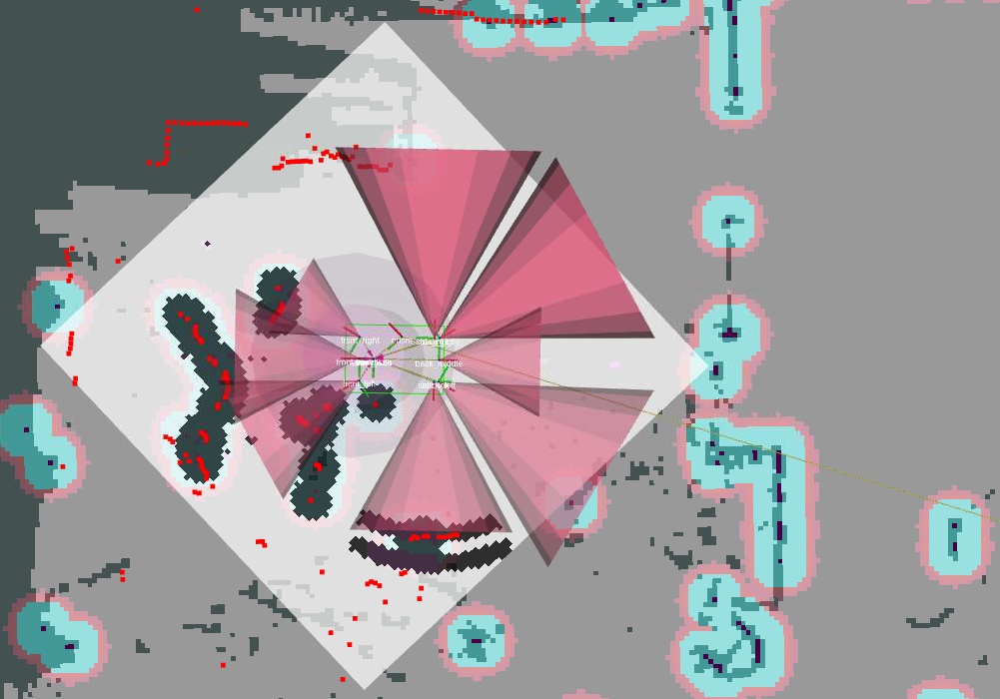

include::../Header.adoc[]
WARNING: this page has to be updated. No longer relevant

== Localization and navigation
The localization and navigation stack is a collection of nodes and plug-ins which process LIDAR data among others and use it to navigate on a pre-generated map.

=== Repository
https://github.com/Windesheim-Willy/navigation_stack[Windesheim-Willy/navigation_stack, role="external", window="_blank"]

=== How does it work

==== Navigation

.Data flow in navigation stack
----
                                       [map_server|1] -----\  [map_server|2]---\
                                                            \                   \
[lidar node] -> [lidar_filters] -> [laser_scan_matcher] -> [AMCL] ------> [move_base] -> [cmd_vel]
                      \                                     /                /
                       \-----------------------------------/----------------/          
----

The LIDAR node captures the data from the hardware device and puts it on the service bus. The LIDAR data is not always perfect since the metal frame of the robot creates invalid data points. These invalid data points confuse the algorithms. This is fixed by adding the 'scan_to_scan_filter_chain' node from the 'laser_filters' package. Using a chain of two filters it is possible to "crop" the LIDAR data. This data is fed to the other nodes.

The 'laser_scan_matcher' node uses the filtered LIDAR data to create odometry data based on the moving data points. The odometry data only tells the stack how much it has moved relative to its starting position. Odometry data is also prone to drift especially when using the 'laser_scan_matcher' since it can't handle big empty spaces. This is where the 'AMCL' node comes into play. The 'AMCL' node takes into account: the estimated starting position, odometry offset from the starting point, lidar data and a lidar map. It can determine the odometry drift based on the lidar data and the map and compensate with a second offset. Because the 'AMCL' also takes into account the map we now have localization.

'AMCL' uses the first instance of the 'map_server', this map server publishes the raw map which was generated by 'hector_map', just slightly cropped and rotated to improve performance. The 'move_base' node uses the second instance of the 'map_server' which publishes a modified map in which incorrectly mapped walls are manually filled in. This is done because the LIDAR can't see reflective materials like glass or mirrors. By filling in these areas the 'move_base' will not try the navigate through glass. The 'AMCL' node however needs a map is is as close to the LIDAR data so it can't localize itself.

This position is then fed into the 'move_base' node which uses the LIDAR data and map to create a maps of obstacles called costmaps. It then uses the position from 'AMCL', the costmaps and a goal to generate a path and start giving commands to the robot to follow that path as closely as possible  

==== Costmaps
RViz shows us three total maps, of which two are the Global costmap and the Local costmap. A small example the view of these maps in RViz is as following:

The gray areas are the pre-generated map of the fifth floor in the T-building of Windesheim. Light gray areas show where Willy can move freely and dark gray areas equal an obstacle (such as a cabinet) or a wall.

The Global costmap is seen as the red/cyan areas around certain walls and obstacles and calculates an inflated distance for each of these obstacles by a set amount, which we've set to around 10 centimeters. 

The local costmap is shown as the white cube around the robot. 
The LIDAR marks obstacles and walls on the local costmap using the distance its lasers measure, visualized as red squares, upon which the local costmap will inflate the obstacle's distance by about 5 to 10 centimeters, indicated by a black area surrounding the red dots.
The cones of the ultrasonic sensors indicate their range, and the navigation stack will mark any obstacle the sensors detect as a small black dot/line in its range, enough to be detected as an obstacle by the navigation stack. 

NOTE: Unfortunately, it is unknown if the cones could be replaced by beams in order to reflect the current capabilities of the ultrasonic sensors, as they only measure in a straight line.

The obstacles persist for a set amount of time, but will not always be removed automatically, after some time or by walking around the robot, the obstacles could clear, but it is also possible to refresh the costmaps by issuing this command in a terminal window:
[source,bash]
----
rosservice call /move_base/clear_costmaps
----

The "footprint" of the robot, visible as the green rectangle in the center, indicates its location and is used in calculating whether or not WTR is in an obstacle or not. It is a key for obstacle detection to work using the following rules:

* If the green rectangle touches a red dot, the robot will assume it has hit an obstacle
* If the green rectangle is inside a black area, it will recognize that it's close to an obstacle, slow down and try to avoid the obstacle to prevent collision.
* If the centerpoint of the robot (base_link) touches a black area, the robot will stop as it assumes it has hit an obstacle.

==== Mapping

.Data flow while mapping
----
[lidar node] -> [lidar_filters] -> [hector_mapping] -> [map_saver]
    \---------> [rosbag capture]
----

The mapping process uses the same LIDAR data and LIDAR filters. The raw LIDAR data can also be captured in a bag-file so this mapping process can be redone off-line. The LIDAR data is fed into the 'hector_mapping' node which will generate a 2d map based on the LIDAR data.

However, this process is not always perfect. It has trouble seeing transparent and reflective surfaces. Objects like chairs and tables can be problematic since the surface area of the legs are small and easy to miss if the LIDAR is not close enough. Furthermore if objects become larger above the height at which the LIDAR measures the object may be drawn too small on the map causing collisions.

The 'hector_mapping' node is not great at erasing objects from the map. So it is best to map a area when there are no moving objects like humans.

=== How to run?
To run the localization and navigation stack you need to have an instance of the ROS Master and the LIDAR node running. If you have used the command alias `startwilly`, the navigation stack is run automatically along with the start of the ROS Master.

To start autonomous navigation manually, you need to invoke the start-up script by hand:

[source,shell]
----
cd ~/Documents/willy/components/navigation_stack/
./start-live-navstack.sh
----

The navigation stack requires a LIDAR-generated map of the environment it must navigate in. This map can be built by manually moving the robot using the keyboard node and running the mapping process. The mapping process can be started with the following command

[source,shell]
----
./start-live-mapping.sh
----

In order to use this map a saved copy is needed. To save the map that is on the service bus use the following command:

[source,shell]
----
rosrun map_server map_saver -f {name of save file}
----

It has proven to be useful to test the software in a VM when access to the hardware is limited. To do so run the 'start-sim-navstack.sh' or 'start-sim-mapping.sh' instead of the commands listed above. These commands will start a replay of a rosbag containing lidar data instead of the real thing. They also set a parameter which tells the nodes to accept out of date timestamps which are required to function in a simulated environment
