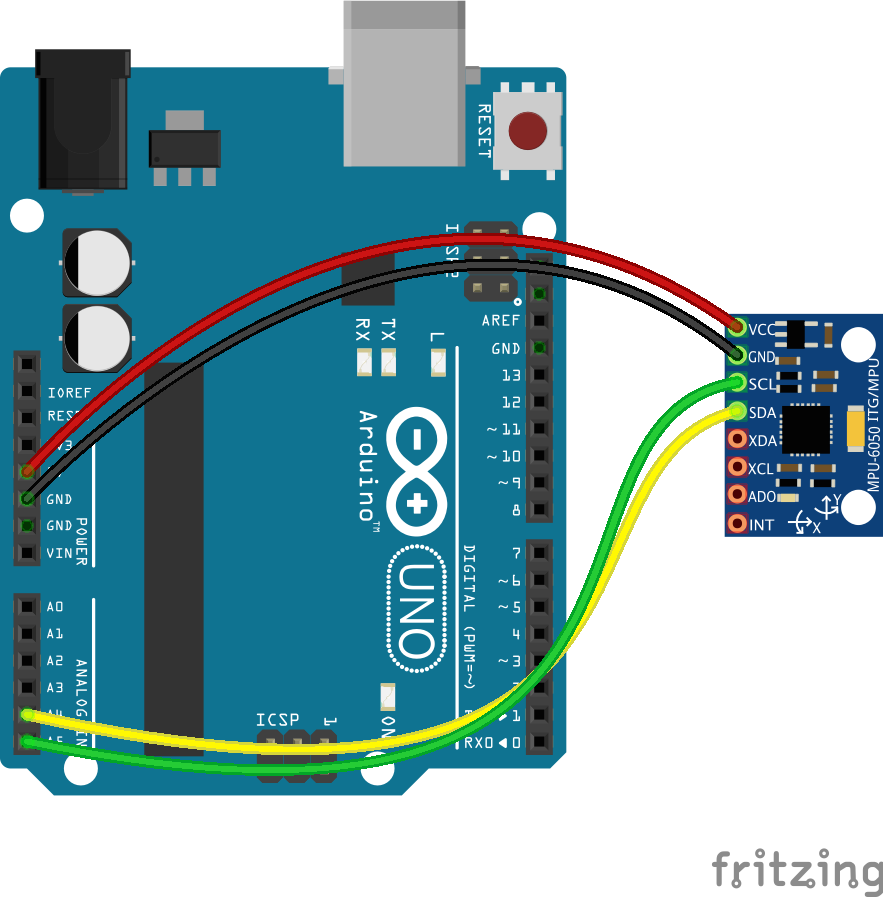

include::../Header.adoc[]

== MPU9250

The MPU9250 is a 9-axis Inertia Measurement Unit. This means that it can detect rotation in 9 directions.
It does this by utilizing an accelerometer, gyroscope and magnetometer.
The IMU is located on the top of the screen, in a 3-d printed box with the words "IMU TOP" printed on the lid.

The magnetometer (AK9863) is separate from the accelerometer and gyroscope, but can be read using the same library. The data sheet is referenced in the technical design document, which also contains a more detailed explanation. 

=== Arduino

The MPU9250 is connected using I2C to an arduino, which does a large part of the processing.
It calculates the quaternion, as well as transforming some of the data into useful units.
These are then changed into separate bytes, and sent via Serial communication to the Sensor Node Raspberry Pi.

=== Raspberry Pi
The raspberry pi stores all the data it receives into a string, which it then proceeds to check for a start byte.
After this, it uses Unions, an old C technique, to process the separated bytes into the desired data types.
These are built into a message, and sent to the master.

If there is an error in the data from the arduino, such as missed data or un-needed data, the entire message is binned and the input is cleared.

==== Quaternions

The MPU9250 uses a complex mathematical system of tracking orientation called "quaternions".
These are a method of storing current rotation in a 3-d space, while avoiding the issue of Gimbal lock found in Euler angles.
While these are complex, they are the preferred method of tracking rotation according to link:https://www.ros.org/reps/rep-0103.html[ROS rep 103].
A comprehensive tutorial on the mathematics behind quaternions can be found link:https://www.3dgep.com/understanding-quaternions/[here].

=== Wire

=== set setpoint to 0
Sometimes it is needed to set the "set point"  to 0. The command to do this is as follows:
[source,shell]
----
rosservice call /imu/set_zero_orientation
----

This will make WTR regard its current heading as the zero point for the IMU, which can be called on startup if the data is misaligned.