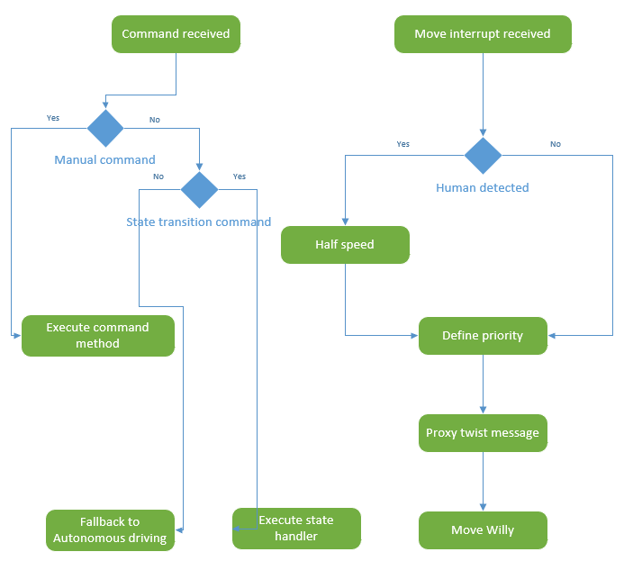
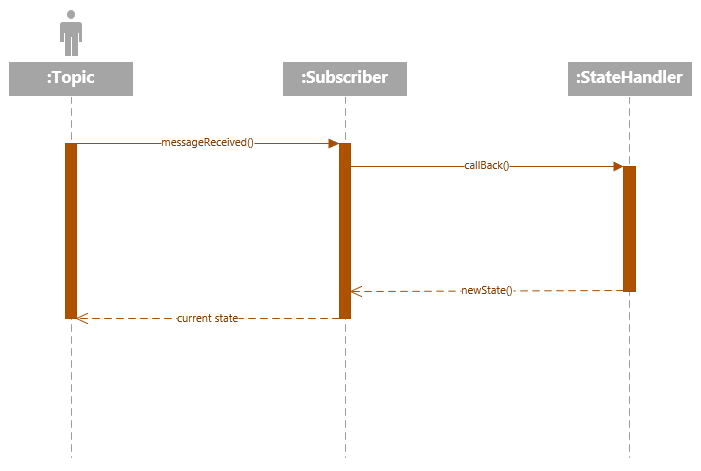
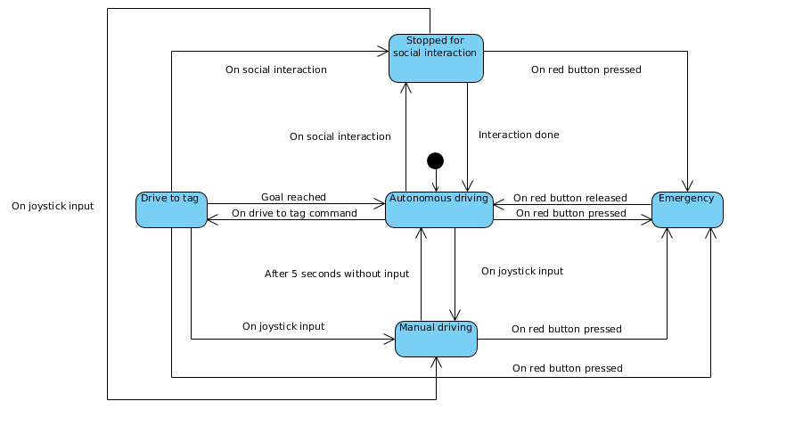

include::../Header.adoc[]

== Brain

The brain brings all the components together. The brain make decisions how and where to drive. This is based on priorities which will be explained on the background chapter.

=== Repository
====
https://github.com/Windesheim-Willy/brain[Windesheim-Willy/brain, role="external", window="_blank"]
====

=== Prerequisites
All other components must be running for the brain to work correctly.

=== How to run?
The brain will start automatic when the main start script of willy is started. The brain node can be started manually by going into the root of the brain repo:

[source,shell]
----
python src/brain.py
----

=== Technical design

The brain gathers a lot of inputs like: the joystick, move_base, AMCL pose, april tags and human detection. It processes these inputs and saves the latest messages in global variables. Every 100 milliseconds a tick in the brain passes where it updates the state machine and sends outputs like the cmd_vel which controls the motor driver. Multiple input can send input to the brain and the brain will proxy one of the inputs depending on its state.

ROS topics are registered in the brain with a callback function which will run asynchronously alongside the main thread when a message is received. 

The brain uses a state machine to keep track of it's current task. The following image is a diagram of the state machine:

