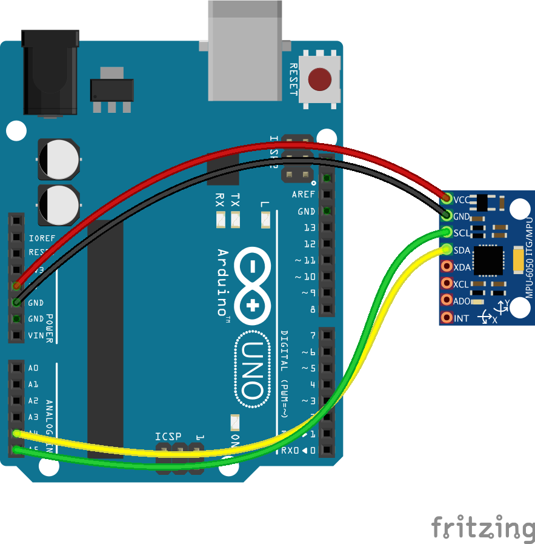

include::../Header.adoc[]

== IMU

The IMU sensor (pose tracking) is used to get a higher accuracy for navigation.

=== Repository
====
https://github.com/Windesheim-Willy/pose_tracking[Windesheim-Willy/pose_tracking, role="external", window="_blank"]
====

=== Prerequisites
The IMU sensor (Arduino) must be connected to the Sonar PI.

=== How to run?
The pose tracking will start automatic when the PI is running. The pose racking node can be started manually by going into the root of the pose tracking repo:

[source,shell]
----
./START start
----

=== Wire

=== set setpoint to 0
Sometimes it is needed to set the setpoint to 0. The command to do this is as follows:
[source,shell]
----
rosservice call /imu/set_zero_orientation
----

=== Background
The IMU data that is published on the topic, is used by move_base. 
