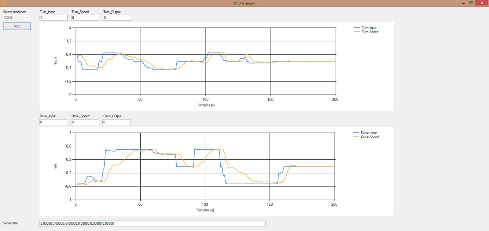

include::../Header.adoc[]

== Motor controller

Willy is based on a mobility scooter. The motor driver was once manually controlled by a joystick unit, but that was replaced by an arduino mega serving as motor controller.
The motor controller is subscribed to the drive topic from ROS, reads out the wheel encoders, compares them and controls the motors of Willy accordingly. This is explained briefly, for further details please read the hardware design and technological design documents.
motor controller listens to the "command velocity" topic and controls the motors of Willy.

=== Repository
====
https://github.com/Windesheim-Willy/motor_controller[Windesheim-Willy/motor_controller, role="external", window="_blank"]
====

=== Starting the motor controller
Normally the motor controller is started automatically when the command below is executed:
[source,shell]
----
startwilly
----
To start the motor controller manually, execute this command:
[source,shell]
----
motorcon
----
When the motor controller is started, the emergency button has to be pressed and reset otherwise no action will be seen.

=== Main program (MotorTest.ino)
The main program communicates with ROS, handles the signals generated by the encoders (by using encoder.h) and controls the motors with a calculated output (from controlloop.h). Important functions are briefly explained below.

==== Arduino reading /cmd_vel messages from ROS
The geometry twist messages broadcast by ROS consist of two variables, turn and run. Turn will be the turn speed in rad/s and run will be the drive speed in m/s. The function reading these messages can be seen below.

[source,cpp]
----
    //Turn and drive variables are read out from ros and stored in irun and idrive.
    void messageCb(const geometry_msgs::Twist& twistMsg)
    {
      irun = twistMsg.linear.x;
      iturn = twistMsg.angular.z;
          
      // store time at which message was received so old instructions are not repeated.
      time_stamp = millis();
    }
----

==== Writing to the drive controller
The code below is used to write to the drive controller of the wheelchair. This is done by serial communication.

[source,cpp]
----
/*  Send values to motorcontroller of the mobility scooter by serial communication.
 *  The motorcontroller will automatically turn off the brakes and the motors will provide torque
 */
void SendToMotor(int Setdrive, int Setturn)
{
  int drive = Setdrive;                                                       //Set value from ros to motorcontroller
  int turn = Setturn;                                                       //Set value from ros to motorcontroller

  //Create data array
  data[0] = 0x6A;                                            //-Datagram always start with 0x6A
  data[1] = drive;                                           //-Drive +-100
  data[2] = turn;                                            //-Turn +-100
  data[3] = 0;                                               //-Driv mode
  data[4] = 0x0c;                                            //-Drive mode: 0x0c=fastest
  data[5] = 0xff - (data[0] + data[1] + data[2] + data[3] + data[4]); //-Checksum

  // Writing the data to the motorcontroller
  for (unsigned char i = 0; i < 6; i++)
  {
    Serial1.write(data[i]);                                 
  }
}
----

==== Broadcasting to the emergency channel
Every iteration within the critical loop of the state of the emergency button will be broadcast. The motor controller will interrupt the circuits on a hardware level when the button is pushed. But in order to prevent wind-up within the PID controller the ROS messages is spoofed by zero. This is done by the function below.

[source,cpp]
----
//safety
void Stop()
{
    irun = 0;
    iturn = 0;
    SendToMotor(0, 0);
}
----

=== Encoders
The encoders are attached to both front wheels. Encoders.h is included in the main program of the motor controller and calculates the speed of the wheel in m/s. The output of the encoders correspondents with the figure below. The code written to decode these outputs to stable speed is quite complex and uses various functions. Therefore we advise to read tech design to get a better understanding if needed.

image::assets/QuadruatureEncoderOutput.png[]

=== Controlloop
The main control loop consist of two PID controllers (TurnController and DriveController). The reference speed (irun and iturn) is compared with the actual speed and the difference (error) is send to the PID controllers. This is implemented in the function below.

[source,cpp]
----
    //Function sets reference, calculates error, then activate the calculation of outputs by the turn and drive functions.
    SetInputRef(float Turn_Input, float Drive_Input, float Speed_Sensor_L, float Speed_Sensor_R)
    {
      if(Turn_Input == 0 && Drive_Input == 0)
      {
        DriveController.Reset();
        TurnController.Reset();
      }

      //calculate speed at which the robot is rotating, unit:  [rad/s]. 0.6 is the distance between the wheels in meters.
      Turn_Speed = (Speed_Sensor_R - Speed_Sensor_L)/0.6; 

      //calculate the speed at which the robot is moving, unit:  [m/s]. 0.5 is used to provide an average between both wheels.
      Drive_Speed = (Speed_Sensor_R + Speed_Sensor_L)*0.5; 

      //calculate errors.
      Turn_Error = Turn_Input - Turn_Speed;
      Drive_Error = Drive_Input - Drive_Speed;

      //errors are send to both controllers to get an output signal.
      Turn_Output = TurnController.Get(Turn_Error);
      Drive_Output = DriveController.Get(Drive_Error);
    }
----

=== PID controller
An PID controller chosen to control the turn and drive speed of Willy. The animated gif below explains the basic function of the three different variables.

image::assets/PID_Compensation_Animated.gif[]

==== Implementation
These variables are set on start by using the initialize function (constructor) and have been tuned to make willy drive smoothly. Below the code for the PID variables construction and PID calculation can be found. The math on these calculations seems easy but the theory is rather complex, we advise to get a basic understanding, before starting to tune or even change our implementation as currently the robot is slow but very stable. For more information we refer you to the link below.

https://en.wikipedia.org/wiki/PID_controller

[source,cpp]
----
    void Initialize(float P, float I, float D)
    {
      K_P = P;
      K_I = I;
      K_D = D;
    }

    float Get(float Error)
    {
      //Calculate Output with PID in velocity form.
      float Output = 0;
      Output = Output_1 + K_P * (Error - Error_1);
      Output += K_I * Error;
      Output += K_D * (Error - 2 * Error_1 + Error_2);

      //save parameters
      Output_1 = Output;
      Error_2 = Error_1;
      Error_1 = Error;

      //limit output to max 100 and min -100
      if (Output > 100)
      {
        Output = 100;
      }
      if (Output < -100)
      {
        Output = -100;
      }

      return Output;
    }
----

==== PID Viewer 

In order to get a better understanding of what is happening and to ease tuning a special program is written. This program was used on a seperated laptop and connects via serial to the Arduino. The program constist of basic graphs representing the input, error and output signals. 
A separate Serial to USB converter is needed to communicate with the Arduino Mega, since the USB port needs to be connected to the laptop.

When building for the first the Platform.io will add some files in the .vscode directory that can be ignored. Its not recommended to add them to GiT. The files have hard-coded paths containing the username and are ignored. 
To flash the Arduino simply press Upload in the Plaform.io extension. 

Alternatively, the Arduino IDE could be used but mileage may vary.
