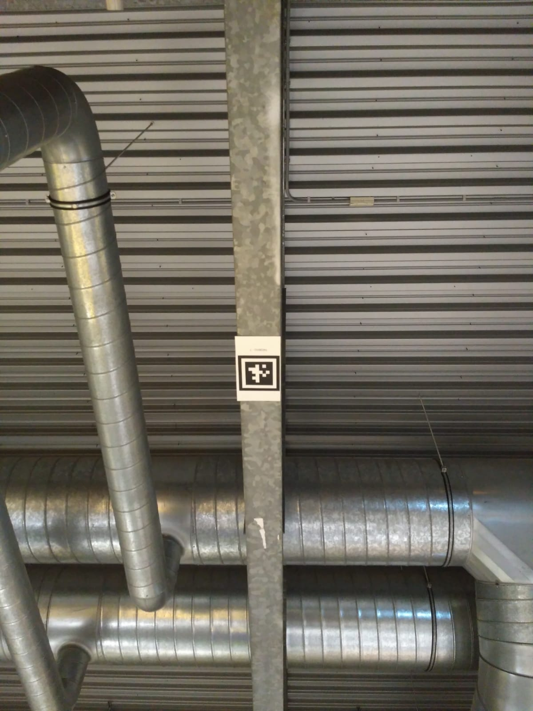

include::../Header.adoc[]

== OpenMV

WARNING: This module is no longer used in favour of orientation measurement by IMU and LIDAR.

The OpenMV camera is used for AprilTag scanning. When a AprilTag is scanned, Willy knows where it is on the map.

=== Repository
====
https://github.com/Windesheim-Willy/openmv_apriltag[Windesheim-Willy/openmv_apriltag, role="external", window="_blank"]
====

=== How to run?
The OpenMV will start automatic when the PI is running. The openMV node can be started manually by going into the root of the openMV repo:

[source,shell]
----
./START start
----

=== Prerequisites
The OpenMV camera must be connected to the Sonar PI.

=== Background

The openMV M7 cam can be used for several purposes. For Willy we use the cam for AprilTag Scanning.

If you look above on T5 you could see AprilTags of the type: TAG36H11. This tag type has a high resolution and is usable for scanning while driving.

=== Zones
There are three zones:

[cols=",",options="header",]
|===============================================
|Zone |Tag ID
|T5 Yellow |1 - 21
|T5 Bridge |30 - 36
|T5 Red |50 - 69
|===============================================

For every AprilTag, we know the x-y coordinates:

[source, python]
----
# Build tag location dictionary
tagLocations = {1:(13.489720850756148, 60.59727947971955, 0.0),
2:(15.934169265195797, 60.933202561559746, 0.0),
3:(20.810319786490506, 60.41751882276302, 0.0),
4:(24.50055443446291, 60.43755116603776, 0.0),
5:(28.07578804452108, 60.138835332979674, 0.0),
6:(31.72803700360133, 60.21433696281538, 0.0),
7:(35.079547458633726, 60.144928942058925, 0.0),
8:(38.86555094259316, 60.061022359125516, 0.0),
9:(42.76742784387715, 60.18446581588793, 0.0),
10:(46.17944236172726, 59.43959194286109, 0.0),
11:(44.86658591585901, 54.932326361019605, 0.0),
12:(41.56825528354129, 55.081602467414015, 0.0),
13:(37.76570212962082, 55.165675939740616, 0.0),
14:(34.22908972386625, 55.347169977516856, 0.0),
15:(30.58898019154235, 55.07027803761846, 0.0),
16:(26.932984917133314, 55.11965596266801, 0.0),
17:(23.205978661221213, 55.18059190272544, 0.0),
18:(19.743041561789195, 55.347504401255364, 0.0),
19:(16.299067248414662, 55.46434990288788, 0.0),
20:(12.100164063844309, 55.42996574075256, 0.0),
21:(9.65735918277374, 55.445542959329764, 0.0),
24:(6.65735918277374, 55.445542959329764, 0.0),
30:(32.8987473161705, 46.41308688279322, 0.0),
31:(33.121147889528785, 43.20021335735613, 0.0),
32:(32.49671958337161, 39.21247637139029, 0.0),
33:(32.599678125770374, 36.425429080274895, 0.0),
34:(32.55513317780795, 32.79463316478886, 0.0),
35:(32.50853311136147, 27.368573944379868, 0.0),
36:(32.409127602788864, 22.26660430671845, 0.0),
50:(13.523372347566175, 17.066372999587333, 0.0),
51:(16.06199102201768, 16.56837403740275, 0.0),
52:(19.256179603045823, 16.34236774262965, 0.0),
53:(24.36634090774053, 16.67868658773296, 0.0),
54:(29.377547116503376, 16.51949373917632, 0.0),
55:(30.2662528686185, 16.515290877639845, 0.0),
56:(35.96912522489601, 16.546644310410148, 0.0),
57:(36.951119660425995, 16.68705958913906, 0.0),
60:(45.33510084675059, 11.802420096806053, 0.0),
61:(25.04931102220155, 11.888528907096841, 0.0),
62:(29.844263537020343, 11.897989352815346, 0.0),
63:(34.33241676941428, 12.018177159286664, 0.0),
64:(38.0079833762018, 12.007359945644666, 0.0),
66:(22.139618917845695, 11.986272812183511, 0.0),
67:(19.678538554314194, 11.909650528877101, 0.0),
68:(15.507593016208999, 11.883949899592288, 0.0),
69:(13.329357525172874, 12.035189725452817, 0.0)
}
----

=== tag scanning
Whe a AprilTag is scanned, the Tag-number, degrees and cardinal direction (N, E, S, W) are published on the topic.
The *Brain* and *Move Base* uses this information that is published on the topic.