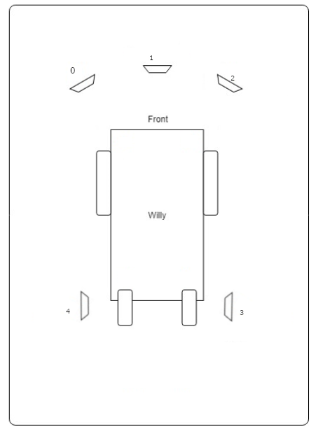

include::../Header.adoc[]

== Sonar
The sonar is a node to process the raw sonar information to the sonar topic.

=== Repository
====
https://github.com/Windesheim-Willy/sonar[Windesheim-Willy/sonar, role="external", window="_blank"]
====

=== How to run?
The sonars will start automatic when the PI is running. The sonar node can be started manually by going into the root of the sonar repo:

[source,shell]
----
./START start
----

=== Background information
To prevent collisions, ultrasonic sensors are used. These sensors
measure distance by using sound. This is made possible by sending out
bursts of high frequency noise, and then waiting for a reflection of
that sound using the HC-SR04 ultrasonic sensor.

image:assets/sonar/sensor_willy.jpg[image, 300]

By using this data Willy is be able to decide if he is able to drive any
further in a certain direction. In the event of Willy being not able to
drive any further, he will decide if there is a direction where he is
able to drive further. This way Willy will be able to drive around
autonomously without collisions. How Willy reacts to objects in his
navigation is researched by a previous group. (Navigation design v0.1,
2017)

The datasheet <<1>> for the HC-SR04 is included in the sources at the bottom of this document.

The sensors all use 5V as can be seen in the schematic:

image:assets/sonar/Sonar.PNG[image, 300]

As shown in the schematic above, all the 3 sensors are connected to the Arduino.

The sensors are connected in the following order:

[cols=",",options="header",]
|===============================================
|Arduino Digital Pin Number |Sonar Sensor Number
|3 |Trigger Sensor 3
|4 |Echo Sensor 3
|5 |Trigger Sensor 0
|6 |Echo Sensor 0
|7 |Trigger Sensor 1
|8 |Echo Sensor 1
|9 |Trigger Sensor 2
|10 |Echo Sensor 2
|11 |Trigger Sensor 4
|12 |Echo Sensor 4
|===============================================

The sensors are placed as follows:

It should be noted that not all the sensor are read at the same time. The front sensors are read in a sequence. Only the lowest value is publisched on the topic. The side sensors 