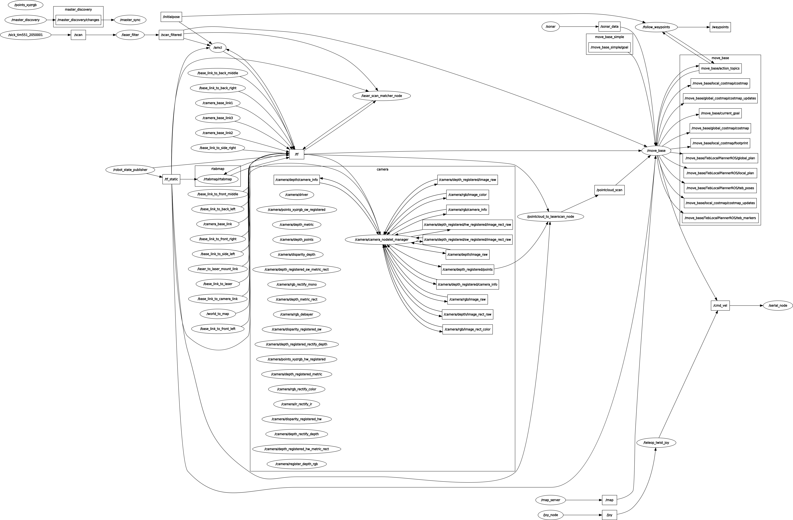
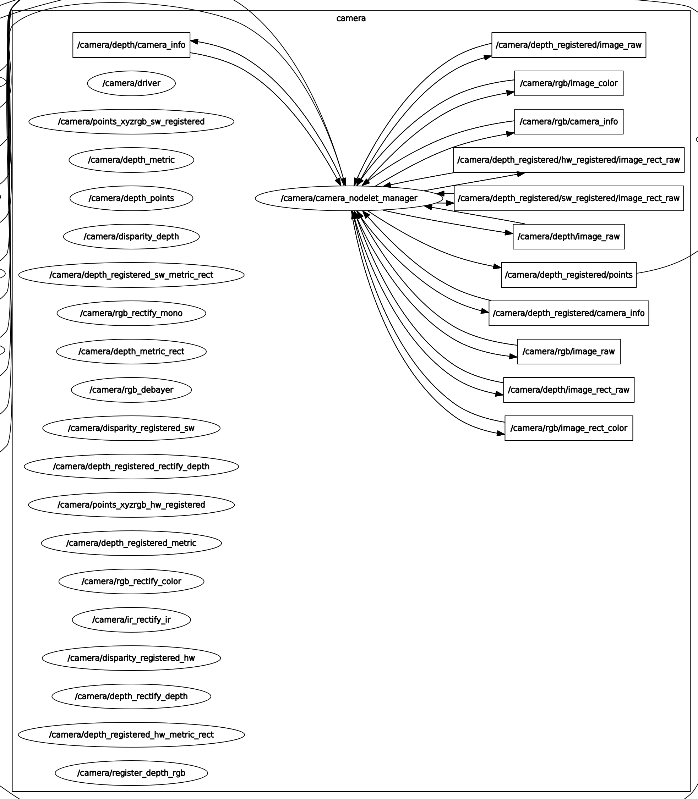
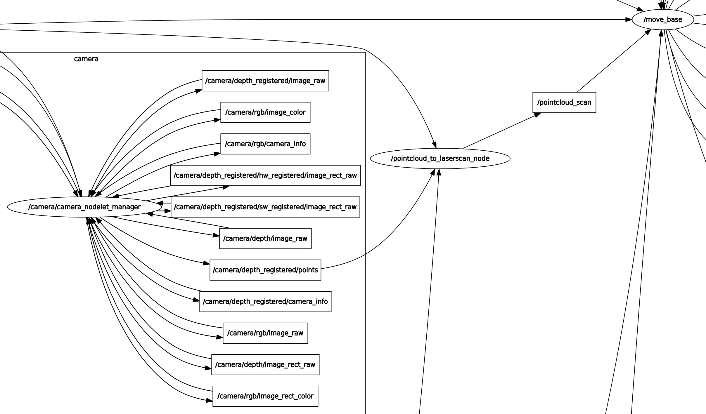
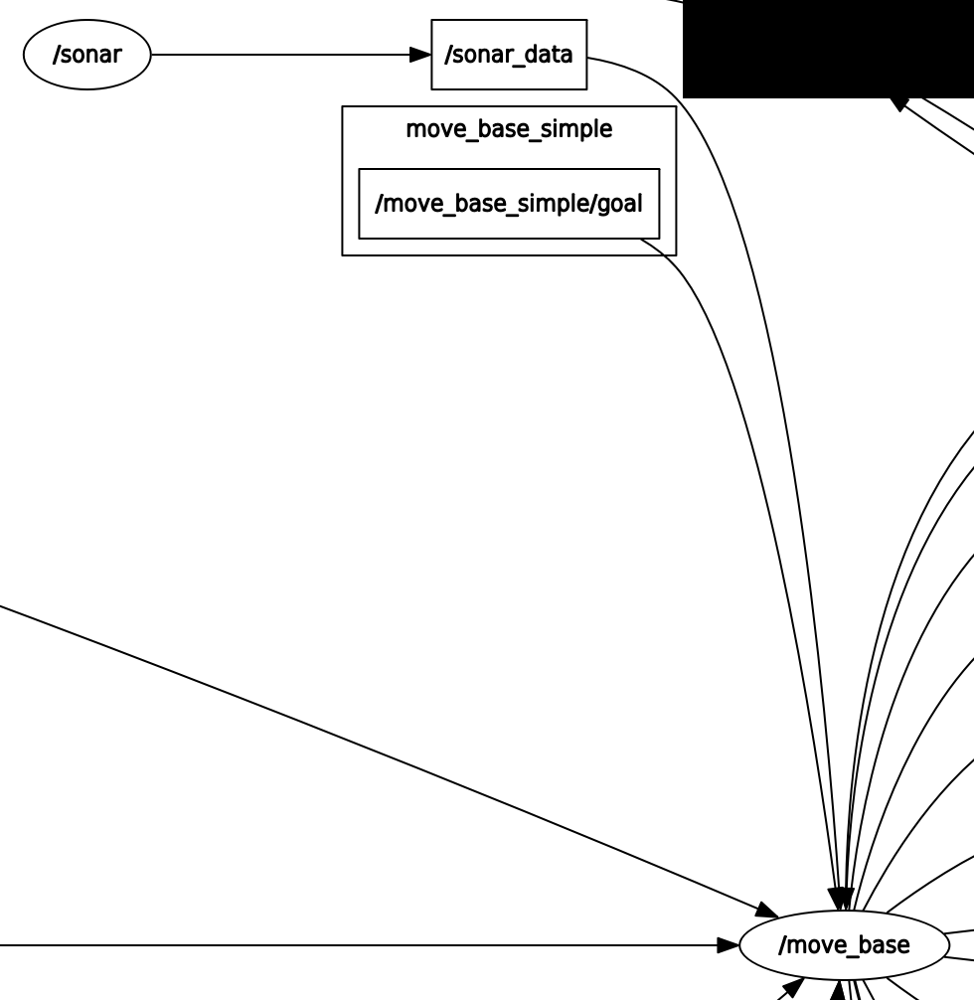
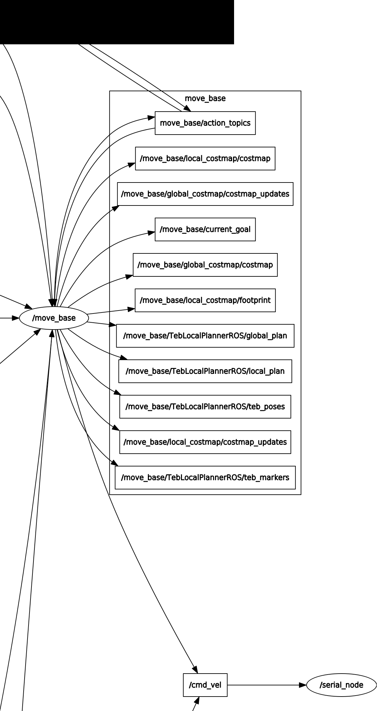
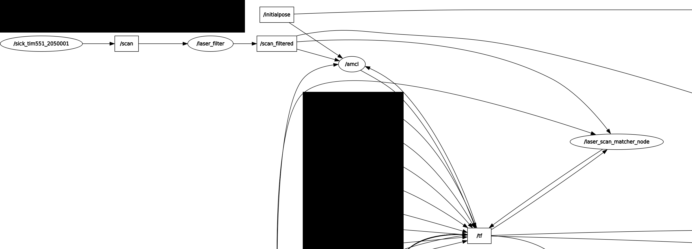
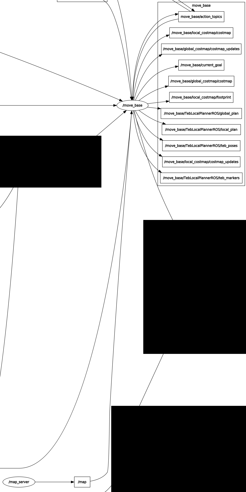

include::../Header.adoc[]
= Manual
=== What is the manual
The manual has been made to let other groups get a headstart in understanding Willy. Every time a new group started the project it was hard to get a grip on all the different aspects. In the manual these aspects have been put together so it's a lot easier to get started. This reduces the time spent on trying to figure out how Willy works and gives a detailed discription on the different problems the last group came across.

=== Where to find the manual
The manual is located in the drive of the last project group.

https://github.com/Windesheim-Willy/WillyWiki/blob/master/getting_started/Handleiding.docx

Follow this tutorial to understand the basics of Willy and where to start.

=== The usage of this manual
To keep the other project groups up to speed that will work on the project after the current group, it is advised to update this document at the end of the project. Add all the added functionality to the manual.

= ROS processes while navigating
In the figure below you can see the rqtgraph for the navigation. This rqtgraph is an overview of the topics and nodes that are active. More in-depth information below.

=== Kinect camera
The image below shows the active nodes and topics for the Kinect camera. This camera sends different camera related data to several other nodes within the process. Most topics on the right are used in the system. Some are for visualization on the RVIZ panel and some are used by other nodes for object avoidance. The nodes on the left are active ones, but not used by the process.

The '/tf' topic publishes to the '/camera/camera_nodelet_manager' node. The node uses this information to know its position within the enviroment.  

=== Pointcloud to LaserScan
Below, the 'pointcloud_to_laserscan_node' node is seen. This node receives pointcloud data from the '/camera/depth_registered/points' topic. This is then converted and sent via the '/pointcloud_scan' topic. Move_base then uses this data and creates an obstacle layer that displays objects within the environment.

=== Sonars
The nodes and topics shown below are published by the Sensor Node Raspberry Pi. The '/sonar' node publishes the '/sonar_data' topic. The '/move_base' node is subscribed to this topic and then processes this to detect and show obstacles within the environment.

=== move_base
Below, the nodes and topics for move_base are seen. This is a very inportant part of the process as it controls the navigation of the robot. It shows the robot's footprint with all sensors attached, displays the costmap on the RVIZ panel and shows all obstacles within this environment. The '/move_base' node listens to the 'move_base_simple/goal' topic. This topic is the goal that is given by a user. Move_base will then navigate towards this goal and create a local and global plan accordingly. The local plan is used to navigate and manoeuvre around obstacles in its local path. The global plan is the route calculated around all global obstacles within the static map. Once the plans are calculated, move_base will sent velocity data to the '/cmd_vel' topic which is used by the serial node (motor controller) to drive the robot.

=== AMCL
AMCL controls the localization part of the robot. The active nodes and topics are shown below. AMCL uses the laserscan data sent by the LIDAR and compares these scans with map data to localize itself within the map. The 'laser_scan_matcher_node' node is used as visual odometry. It compares consecutive laserscans and publishes to the '/tf' topic.

=== Map
Below, some nodes and topics from move_base and map_server are shown. Map_server is used to upload a 2D map to the process. The 'map_server' node sends this map through the '/map' topic to move_base. Move_base uses this data to create a costmap and displays this map to the RVIZ panel. 

