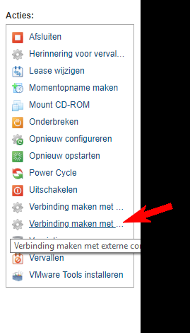

include::../Header.adoc[]

== Setup Skylab Enviroment

Skylab consist of 3 major components:

* Firewall (for connectivity)
* ESXhost or Virtualbox on Windowshost
* Ubuntu Servers

This page explains howto setup the basic Skylab environment.

=== First step request a skylab environment

*	Request project lab use: “Project Willy” as a reference, this is a known project for Skylab managers. Via https://skylab.windesheim.nl (Login with: studentnr only! not with @student.windesheim.nl)
*	After approval you can request machines.

=== Next request machines
*	First request a PFsense firewall.

image::media/requestpfsense.png[]

* Next request a Windows 10 or Server machine to configure the PFsense firewall.

* Next configure correct networks to adapters. Goto items > select Machines on the left > click the item which blueprint name is “pfsense”. Select “opnieuw configureren”.

image::media/pfnwadapter.png[]

* Next select network > Adaptor ID 1 and click: “bewerken” and select <studentnr>studentnet0, this is your default lan. Next do the same for Adaptor ID 0 but here select the Transit01-dhcp network this is network gives you internetaccess, also known as WAN port.

=== Configure Pfsense

* Connect to the pfsense firewall through the console option in Skylab.

*	Login with admin and default password: pfsense and check interfaces Lan should be 192.168.1.1 and Wan> DHCP 145.44.234.* . If not press option 1 and select correct interfaces.
*	Next perform step 4 on the Windows machine and login to the console of this machine:
with administrator and default password: Welkom01!
*	Browse to the pfsense firewall default ip-adress: http://192.168.1.1
*	Login to the pfsense with default admin/pfsense
*	Make sure internet is working correctly on firewall.
*	Go to Diagnostics > Backup/restore and select the config file (sharepoint\skylab): pfsenseskylab.xml and click restore.
*	Wait 10 minutes, because it will install nessecary packages, which takes a while, then restart the Windows Machine.
*	Now the firewall can be managed at: http://10.10.1.1
*   To create a new vpn user goto > system > user manager
*   Next click: add user and fillout the username and password and make the user a member of the VPN group.

=== Connect Willy to Skylab

*   First make sure the router node (rpi) and laptop are turned on. and verify you have an internet connection.
*   Next verify vpn connection: On the laptop try to ping to 10.10.1.1 if replies are succesfull it all works!
*   If not please check DNSName: ping skylabwilly.dynu.net (this should point to currenct Skylab ip) If not please change manually: https://www.dynu.com/en-US/ControlPanel/DDNS login with Willy google account.
* If this does not work, reimage the Pi version model 3b+ with the version found on sharepoint. (routernode.img)

NOTE: This could be an out-of-date image, since OpenWRT was recently (as time of writing at 12/02/19) ported to the 3b+.

*   A more detailed description can be found on sharepoint in the skylab folder on how to set up openwrt.

=== Connect to Skylab over VPN Client

*   Now install the openvpn client, the installer can be found on sharepoint: \skylab\install
*   After installation you can connect to skylab by starting the openvpngui, then rightclick on the icon in the taskbar and select connect to skylabwilly.dynu.net and enter username password from before.
*   To verify connection type ping 10.10.1.1 (which is the pfsense firewall in skylab).

