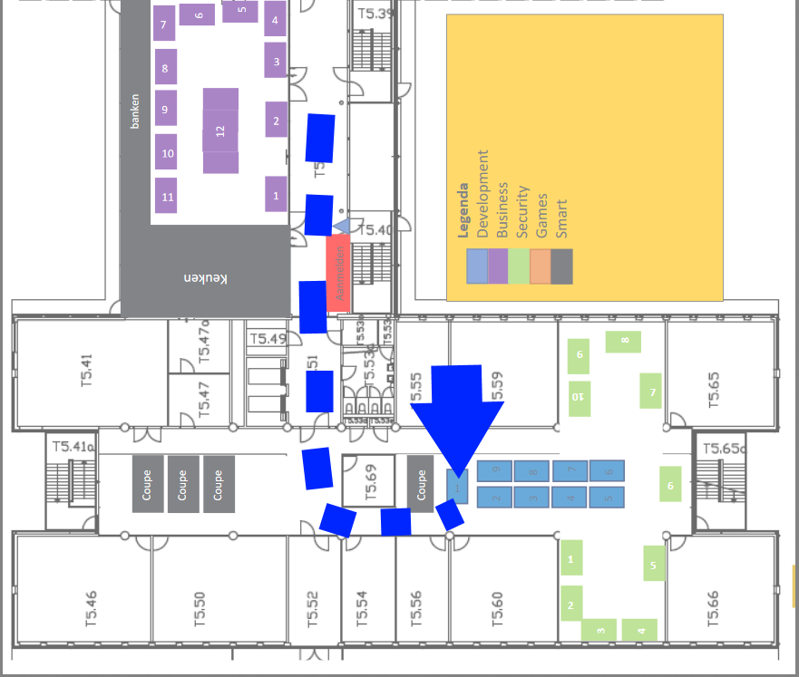

include::Header.adoc[]

image:https://travis-ci.org/Windesheim-Willy/WillyWiki.svg?branch=master["Build Status", link="https://travis-ci.org/Windesheim-Willy/WillyWiki"]

== Welcome

Welcome to project Willy. Before starting the project it is useful to know a few things about the project. Our first advice is to become acquainted with Willy.
Follow our WillyWiki from begin to end and try to understand how to use Willy.
Keep in mind that the project Willy has been run by multiple groups, and some features are outdated or no longer relevant.
These have been cleaned up as much as possible, but there might be some remnants or missed parts.

== Code
All code made for Willy can be found on the github repo, link:https://github.com/Windesheim-Willy/[Github Willy code].
In order to add contributors to the repo, use the login that is provided in the table of login details for the artofrobotics.
After having done so, be sure to promote everyone to the appropriate levels so that they can upload code and perform merge/pull requests.

== Documentation
Documentation delivered to the coach by previous groups can be found in their respective sharepoints.
The links to these are found at the bottom of the sidebar, under the archive header.

== Wiki
Documentation on the Wiki contains all the details about Willy and the project.
If certain details about design decisions, configuration, hardware or other components about Willy cannot be found, more details can be found on Google Drive.

[NOTE]
--
This wiki is public and should not contain any private information nor passwords.
--

[TIP]
--
Use Github's search to find certain keywords in the content of the wiki. link:https://github.com/Windesheim-Willy/WillyWiki[Github WillyWiki]
--

[TIP]
--
For more information about Willy's previous life as garbage collector view link:https://artofrobotics.github.io/WillyWiki/[Willy the garbage collector]
--

== Where is Willy?
Project Willy is found at Windesheim Campus on T5, walking route is seen below:

This area is known as "The innovation lab".
The code to open the door can be obtained from the teacher coaching the project.

== Status

The table below shows all the milestones and their current status.

[width="100%",options="header,footer"]
|====================
|Milestone  |Researched  |Realized  |Tested  |Category
|Assessment current status|Done  |Done  |Done  |Documentation
|Willy Improvisation  |Done  |Done  |Done  |Hardware Software Documentation
|Design  |Done  |Done  |Done  |Software
|WillyWiki    |Done  |Done  |Done  |Software
|Willy web | Done | Done  | Done  | Software
|Indoor navigation  |Done  |Done  |Done  |Software Hardware
|Plating | Done  | Needs update |  |Hardware
|Social interaction |Done  |In progress  |  |Software
|====================

